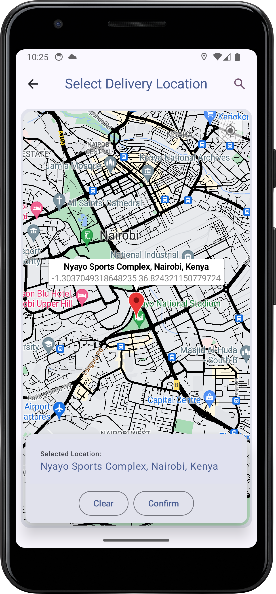

# Location Picker

<video width="640" height="480" controls>
  <source src="screenshots/maps%20rec.mp4" type="video/mp4">
</video>

## Libraries used:

* Secrets Gradle Plugin
* Google Places API
* Google Maps SDK for Android

